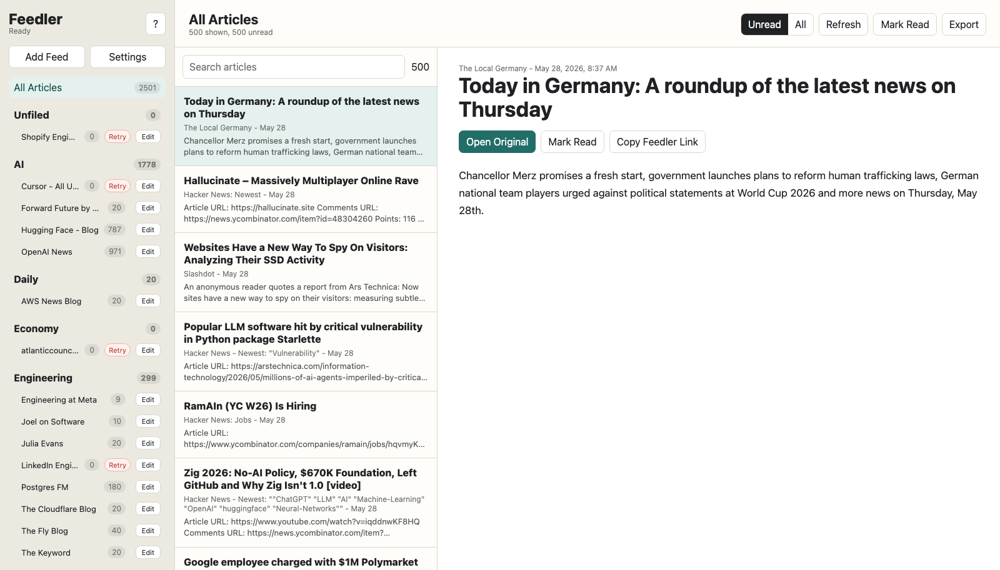
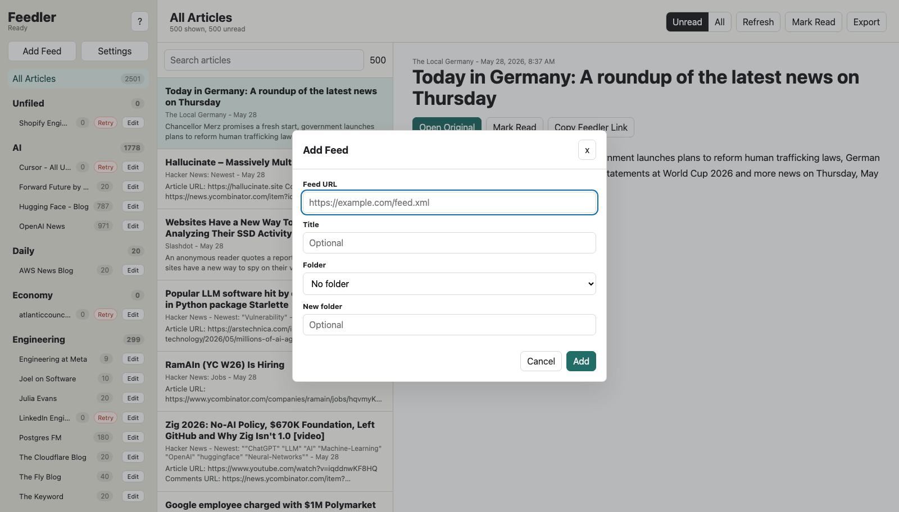
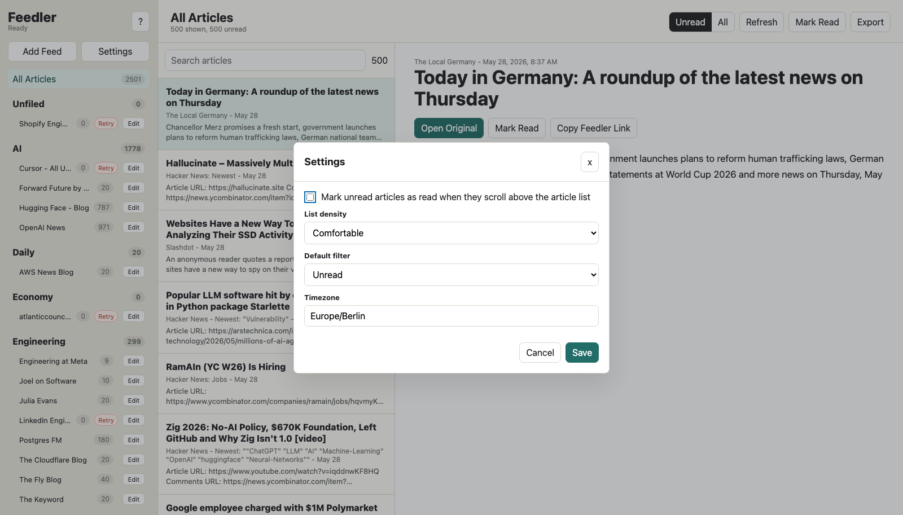
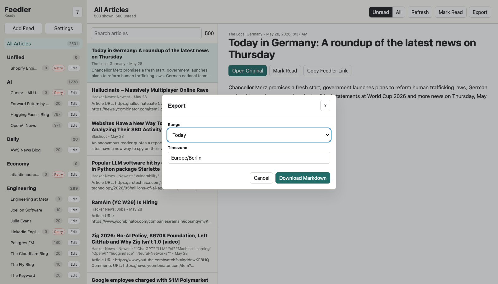
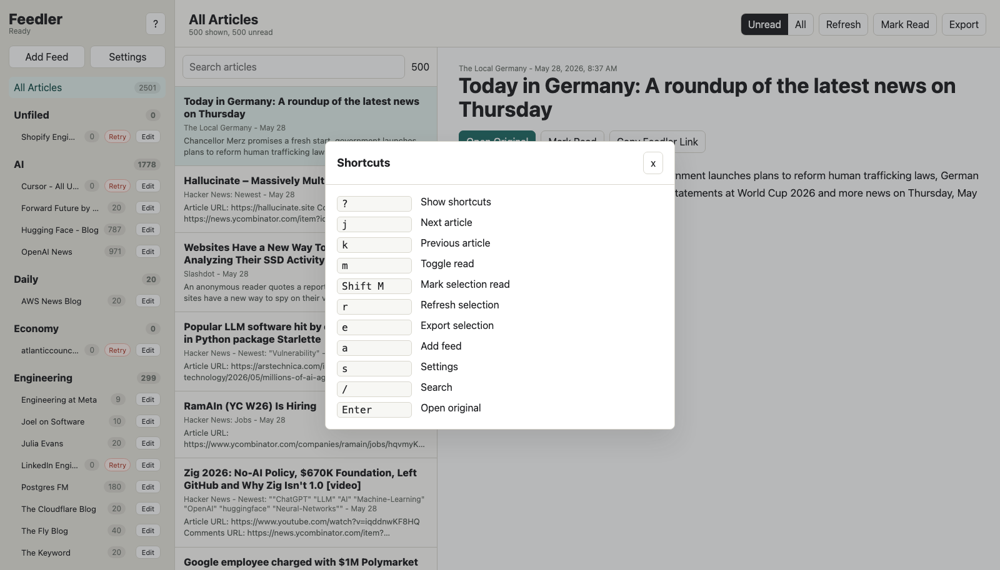

# Feedler

Feedler is a single-port web feed reader built from the local `Feeds.opml` export.

## Run

```sh
docker compose up --build
```

Open `http://localhost:8080`.

The first run imports `Feeds.opml` into SQLite and starts a background refresh. Data is stored in the Docker volume `feedler-data`.

## Screenshots

These are full-resolution PNG screenshots captured from the running Docker app.

### Reader overview

The main layout keeps folders and feeds on the left, the selected article list in the middle, and the reading pane on the right.



### Add and organize feeds

Feeds can be added by URL, assigned to an existing folder, or placed into a new folder directly from the UI.



### Reader settings

Settings include optional mark-as-read-on-scroll behavior, list density, default filter, and timezone.



### Markdown export

Exports are scoped to the current selection and can produce today or this-week Markdown using the configured timezone.



### Keyboard shortcuts

Press `?` in the app to open the shortcut reference.



## Features

- Web UI served by the Go backend on one port.
- SQLite persistence for folders, feeds, articles, read state, and settings.
- OPML import from Reeder-style exports.
- Add, rename, move, delete, refresh, and retry feeds from the UI.
- Visible per-feed fetch errors.
- Optional mark-as-read-on-scroll behavior.
- Scoped mark-all-read for all articles, a folder, or a feed.
- Markdown export for today or this week, scoped to the current selection and using the browser timezone by default.
- Keyboard shortcuts; press `?` in the app.
