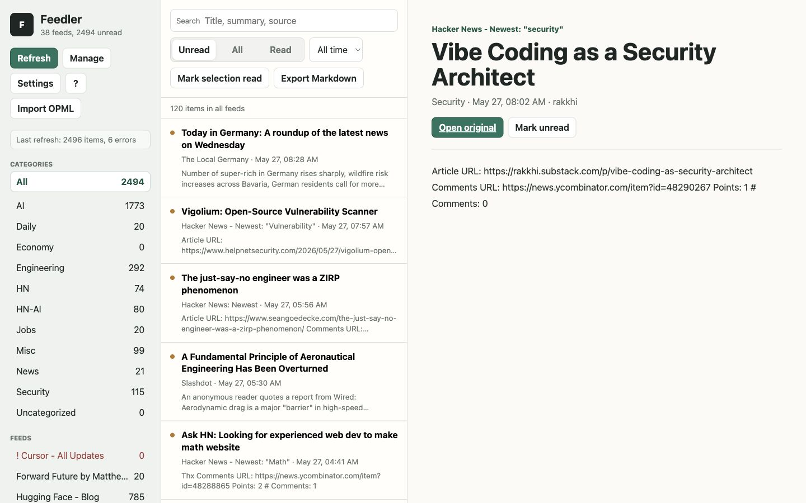

# Feedler

A local, Dockerized feed reader that imports OPML from Reeder, serves the frontend and backend from one Go process, stores state in SQLite, and exports feed digests as Markdown for AI review.

## Preview



## Run

```sh
docker compose up --build
```

Then open <http://localhost:8080>.

The first startup imports `Feeds.opml`, stores data in the `feedler-data` Docker volume, and starts a feed refresh in the background.

## Features

- Reeder-style OPML import from `Feeds.opml`, plus OPML upload in the UI.
- Single service and single exposed port.
- SQLite persistence for feeds, items, and read/unread state.
- Manual refresh, startup refresh, and scheduled refresh every 30 minutes.
- Category and feed navigation, search, date filters, read tracking, and mark-visible-read.
- Feed management from the UI: add feeds by URL, rename feeds, move feeds between folders, delete feeds, and retry one errored feed.
- Optional Reeder-style mark-read-on-scroll for unread list items that move above the list viewport.
- Settings for scroll-read behavior, list density, and default filter/range.
- Keyboard shortcuts with `?` help.
- Scoped mark-all-read for the current all-feeds, folder, or feed selection.
- Scoped Markdown exports for Today Reads, This Week Reads, and Unread Reads with original links and Feedler item links. Today and week filters use the browser timezone passed by the UI.
